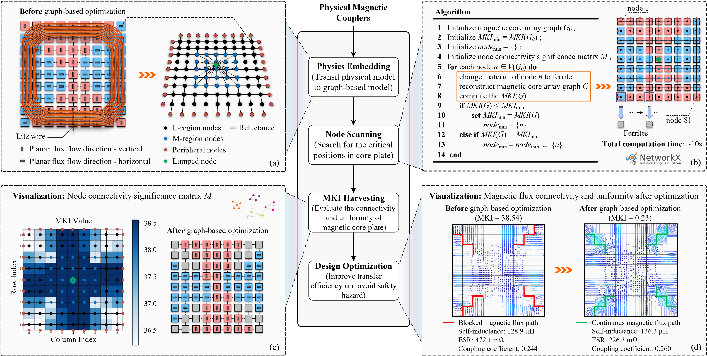
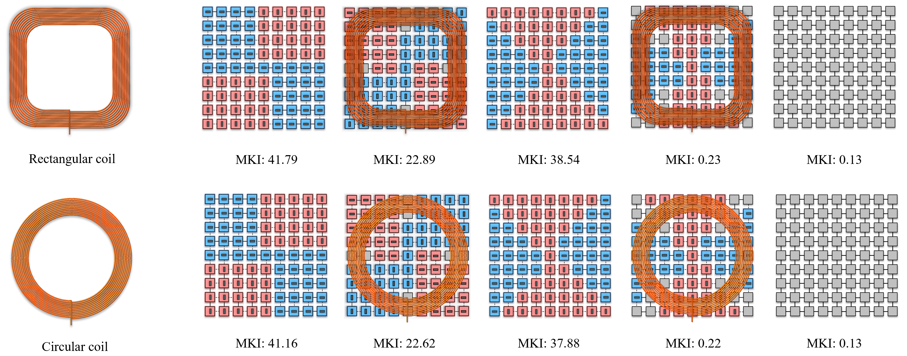

# Quantifying the Magnetic Connectivity and Uniformity in Planar Magnetic Arrays: A Graph Theory Approach

`-` A graph-based magnetic coupler model for rapid core arrangement exploration in IPT systems;

`-` Users can modify the structure and materials of magnetic cores to evaluate and optimize the magnetic connectivity and uniformity of planar magnetic arrays for their specific design requirements;

`-` The step-by-step explanation for calculating the Magnetic Kirchhoff Index can be found in the **Model folder**;

`-` It is provided for research and educational purposes only.
